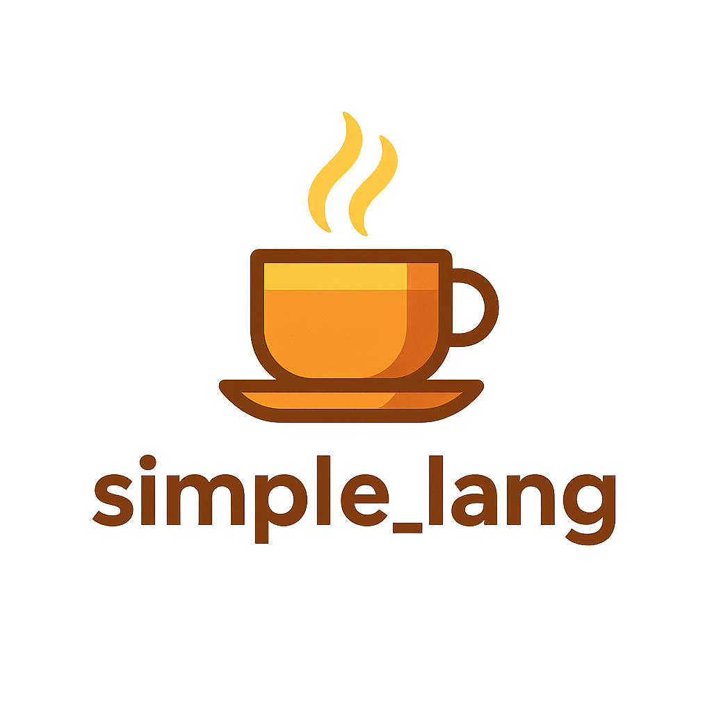

> A simple programming language created by GenAI with minimum human intervention.

---

## 🌞 What is `simple_lang`?

**`simple_lang`** is a minimal, strict, statically-typed programming language designed and implemented via a generative GenAI-driven development workflow. 

It supports:

- Explicit types (no inference or implicit conversions)


  ✅ Allowed (with explicit conversion):
  ```
  text: string = int_to_string(42);
  ```
  🚫 Not Allowed:
  ```
  text: string = 42;  // ❌ No implicit i32 → string
  ```

- Basic arithmetic operations (`+`, `-`, `*`, `/`)

  ```
  count: i32 = 42;
  result: i32 = count + 8;  
  ```
  
- Simple string and integer handling

  You can declare variables of type string.
  Assign and store literal text values.

  ```
  message: string = "Hello, World! Your code belongs to the Entity!";
  ```
  
- Function declarations with typed parameters and return values

  Parameter types must be specified, and
  the return type must also be specified.

  ```
  add_numbers: function(a: i32, b: i32) -> i32 {
    return a + b;
  };
  ```

- Strict syntax rules (every statement ends in `;`)

  ```
  count: i32 = 42;
  ```
  
- In-file unit tests and readable modular code

---

## 🚀 Run the Demo

Run all `simple_lang` demo programs using the built-in runner:

Build and Run

```bash
cd simple_lang_demo_runner
cargo run
```

```
=== simple_lang Demo Runner with Type Checking ===
============================================================
Running: demo_program/hello_world.lang
============================================================
📄 Source code:
----------------------------------------
main: function() -> i32 {
    message: string = "Hello, World! Your code belongs to the Entity!";
    count: i32 = 42;
    
    // Display message
    print(message);
    
    // Arithmetic operations
    result: i32 = count + 8;
    print(int_to_string(result));

    return 0;
};
----------------------------------------
✅ Parsing successful
📊 Program info:
   Functions: 1
   - main (params: 0, return: I32)

🔍 Type checking:
----------------------------------------
✅ Type checking passed

🚀 Execution output:
----------------------------------------
Hello, World! Your code belongs to the Entity!
50
----------------------------------------
✅ Program completed successfully (exit code: 0)
============================================================
Running: demo_program/nested_function_calls.lang
============================================================
📄 Source code:
----------------------------------------
// Simple strict syntax - every statement must end with semicolon
// Type declarations are explicit and required
// No implicit conversions

add_numbers: function(a: i32, b: i32) -> i32 {
    return a + b;
};

main: function() -> i32 {
    message: string = "Hello, World! Your code belongs to the Entity!";
    count: i32 = 42;
    
    // Display message
    print(message);
    
    // Arithmetic operations
    
    // nested function call 
    result: i32 = add_numbers(count, 8);
    
    print(int_to_string(result));

    return 0;
};


----------------------------------------
✅ Parsing successful
📊 Program info:
   Functions: 2
   - add_numbers (params: 2, return: I32)
   - main (params: 0, return: I32)

🔍 Type checking:
----------------------------------------
✅ Type checking passed

🚀 Execution output:
----------------------------------------
Hello, World! Your code belongs to the Entity!
50
----------------------------------------
✅ Program completed successfully (exit code: 0)
============================================================
Running: demo_program/control_flow.lang
============================================================
📄 Source code:
----------------------------------------
// Simple strict syntax - every statement must end with semicolon
// Type declarations are explicit and required
// No implicit conversions

// Arithmetic operations
add_numbers: function(a: i32, b: i32) -> i32 {
    return a + b;
};

// Control flow
check_positive: function(num: i32) -> i32 {
    if (num > 0) {
        print("Number is positive");
        print(int_to_string(num));
    };
    
    return num;
};

main: function() -> i32 {
    message: string = "Hello, World! Your code belongs to the Entity!";
    count: i32 = 42;
    
    // Display message
    print(message);
    
    // nested function call 
    result: i32 = add_numbers(count, 8);

    // Control flow inside check_positive
    result_checked: i32 = check_positive(result);

    text: i32 = 42;

    return 0;
};


----------------------------------------
✅ Parsing successful
📊 Program info:
   Functions: 3
   - add_numbers (params: 2, return: I32)
   - check_positive (params: 1, return: I32)
   - main (params: 0, return: I32)

🔍 Type checking:
----------------------------------------
✅ Type checking passed

🚀 Execution output:
----------------------------------------
Hello, World! Your code belongs to the Entity!
Number is positive
50
----------------------------------------
✅ Program completed successfully (exit code: 0)
============================================================
Demo runner completed!
============================================================
```

⚠️ **Status: Work in Progress**  
This project is not finished yet — it is under development and evolving. 
